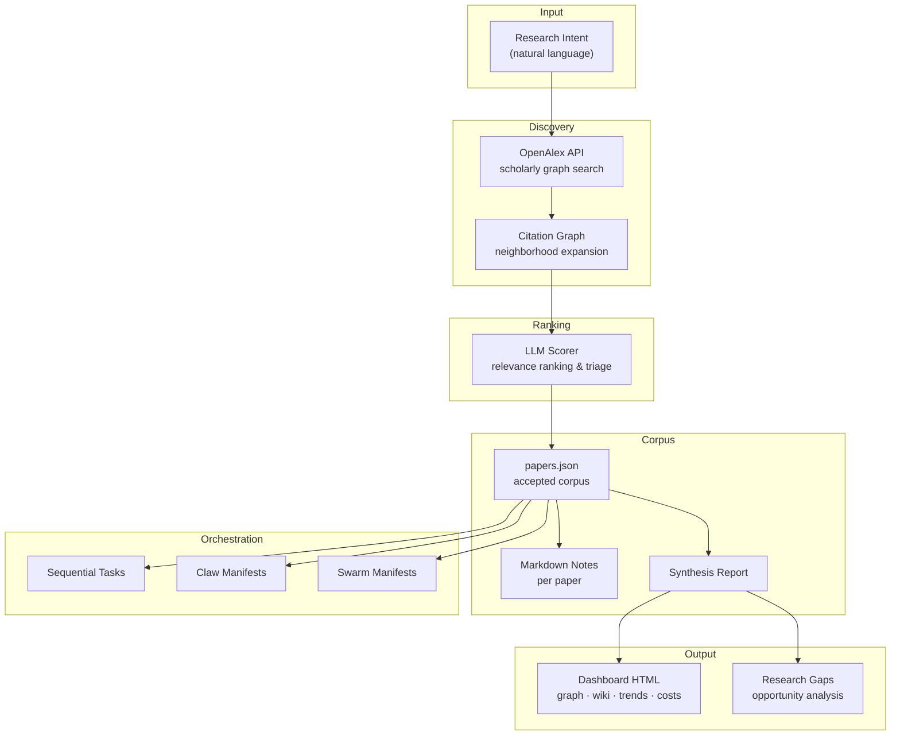
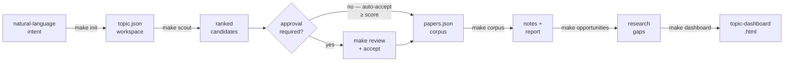
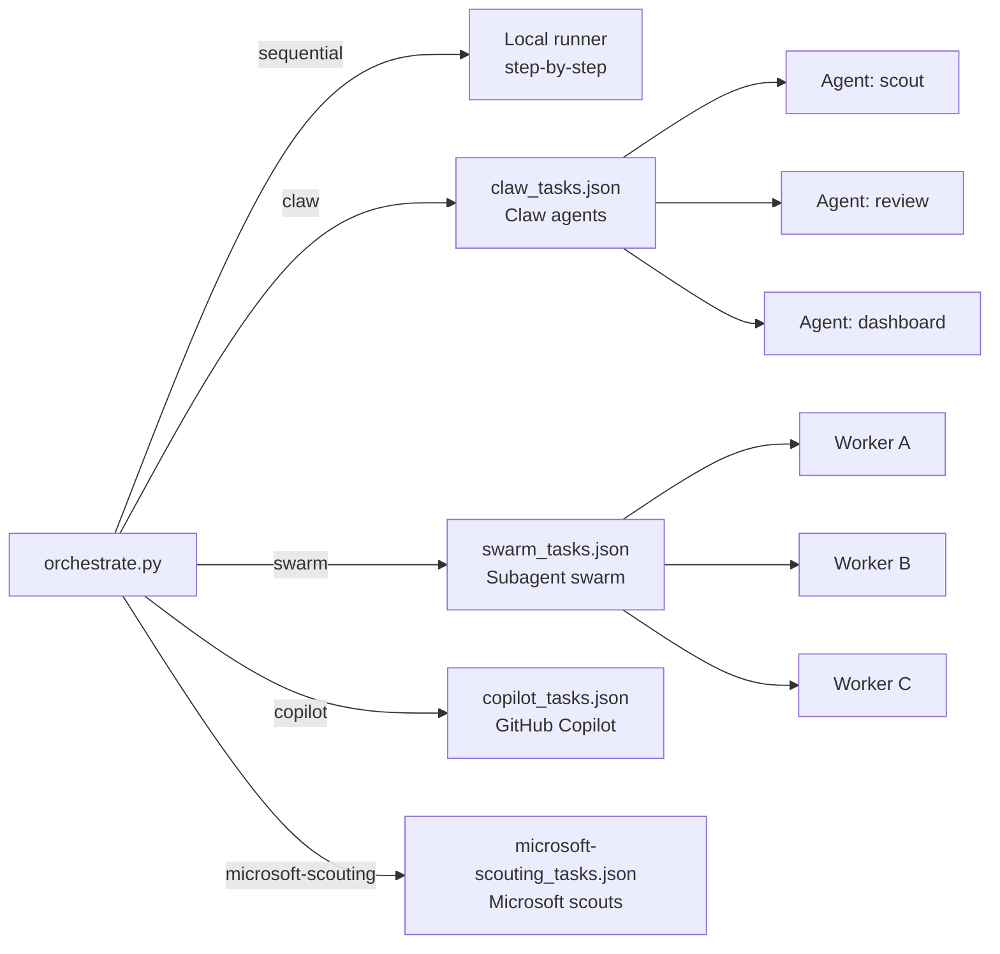

# AI Topic Scout — Automated Literature Review & Paper Discovery for AI Agents

[](https://github.com/ginaecho/topic-scout/stargazers)
[](https://opensource.org/licenses/MIT)
[](https://www.python.org/)
[](https://openalex.org/)

> **The hard part of research is not finding papers — it's maintaining a living corpus that keeps up with a field.**

**AI Topic Scout** is an open-source multi-agent tool that turns a plain-language research intent into a topic-specific, self-updating literature review workspace. It follows the pattern of focused research scouts such as EvaPaper, but makes the topic contract reusable: the same repo can generate a new scouting workspace for any research question, then hand that workspace to Codex, GitHub Copilot, Copilot CLI, Microsoft scouting-style agents, Claw-style agents, or swarm execution.

It integrates [OpenAlex](https://openalex.org/) scholarly graph search, LLM-backed relevance ranking, citation-graph expansion, and multi-agent task emission — so you can build and maintain a living paper corpus for any AI research topic without manual searching.

---

## ⚡ TL;DR

Describe a research topic in natural language -> `make init` generates a workspace -> `make scout` queries OpenAlex, ranks candidates with an LLM, and auto-accepts papers above a relevance threshold -> `make dashboard` produces an interactive HTML dashboard with a citation graph, research wiki, trends, cost tracking, and gap analysis. Emit the full workflow as Codex/Copilot-readable, Claw, Microsoft scouting-style, or swarm task manifests for multi-agent orchestration. One full run costs cents of LLM API.

---

## 🏗️ Architecture



---

## 🚀 Quick Start

```bash
codex login
make init          # refine intent → generate topic workspace
make scout         # OpenAlex search + LLM ranking
make corpus        # build paper notes + synthesis report
make opportunities # generate research gaps
make dashboard     # interactive HTML dashboard
```

**End-to-end pipeline:**



**Provider options:**

```bash
make init                                          # Codex CLI — no API key needed
export OPENAI_API_KEY="..." && python3 scripts/init_topic.py --provider api
python3 scripts/init_topic.py --offline            # no LLM call during setup
python3 scripts/scout.py --accept-score 8.0        # custom acceptance threshold
python3 scripts/scout.py --offline                 # OpenAlex only, zero tokens
```

---

## 📦 Outputs

| Artifact | Description |
|---|---|
| `data/candidates.json` | Discovered and LLM-ranked candidate papers |
| `data/papers.json` | Accepted corpus + full scout history |
| `reports/research_report.md` | Synthesized report over accepted papers |
| `data/research_opportunities.json` | LLM-generated research gaps |
| `topic-dashboard.html` | Interactive dashboard: graph · wiki · trends · costs |
| `data/claw_tasks.json` | Claw-oriented task manifest |
| `data/swarm_tasks.json` | Swarm-oriented task manifest |
| `data/copilot_tasks.json` | GitHub Copilot-oriented task manifest |
| `data/copilot-cli_tasks.json` | Copilot CLI-oriented task manifest |
| `data/microsoft-scouting_tasks.json` | Microsoft scouting-style task manifest |

`make reset` removes only generated workspace artifacts; source, schemas, and tracked examples remain.

---

## 🤖 Multi-Agent Orchestration



```bash
python3 scripts/orchestrate.py plan              # show the generated task plan
python3 scripts/orchestrate.py run --mode sequential
python3 scripts/orchestrate.py emit --mode claw
python3 scripts/orchestrate.py emit --mode swarm
python3 scripts/orchestrate.py emit --mode copilot
python3 scripts/orchestrate.py emit --mode copilot-cli
python3 scripts/orchestrate.py emit --mode microsoft-scouting
```

Every emitted manifest includes the topic contract, command surface, role brief paths under `agents/`, required contract files, task inputs, task outputs, and dependency order. Runtimes can execute the manifest directly or translate it into their own planner format.

---

## 🛠️ Tool Surface for AI Agents

This repo is structured so coding agents and research agents can treat it as a **tool surface**, not just source code.

| Command | Action |
|---|---|
| `make init` | Create topic workspace from natural-language intent |
| `make scout` | Discover and rank candidate papers via OpenAlex + LLM |
| `make corpus` | Rebuild paper notes and synthesis report |
| `make opportunities` | Generate evidence-backed research gap analysis |
| `make dashboard` | Regenerate interactive HTML dashboard |
| `make reset` | Clear generated workspace for a fresh topic |

Review flow (approval-gated):

```bash
make review
python3 scripts/accept_candidates.py openalex:W123 openalex:W456
make corpus && make opportunities && make dashboard
```

Example outputs live under `examples/ai-in-hiring-processes/` with a complete workspace, accepted corpus, reports, dashboard artifacts, and task manifests.

---

## 🧬 Tech Stack & Indexing Keywords

- **Data source:** OpenAlex scholarly graph API, citation-neighborhood expansion
- **Ranking:** LLM-backed relevance scoring (Codex CLI or OpenAI Responses API)
- **Orchestration:** multi-agent task manifests for Codex, GitHub Copilot, Copilot CLI, Microsoft scouting-style agents, Claw, and swarm execution
- **Output:** Markdown notes, synthesis report, interactive HTML dashboard, JSON manifests

**This repo is designed to match searches for:**
`automated literature review` · `AI paper discovery` · `OpenAlex Python` · `citation graph exploration` · `research scouting workflow` · `multi-agent research automation` · `LLM paper ranking` · `research gap analysis` · `living corpus maintenance` · `paper triage tool` · `Claw task manifest` · `swarm agent research` · `GitHub Copilot research workflow` · `Copilot CLI task manifest` · `Microsoft scouting agents` · `research monitoring automation` · `academic paper search agent`
