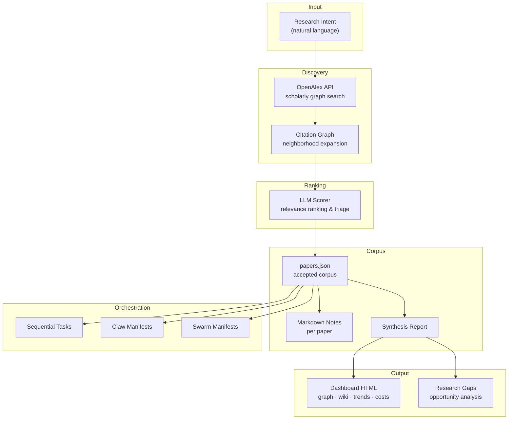
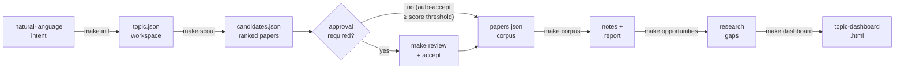
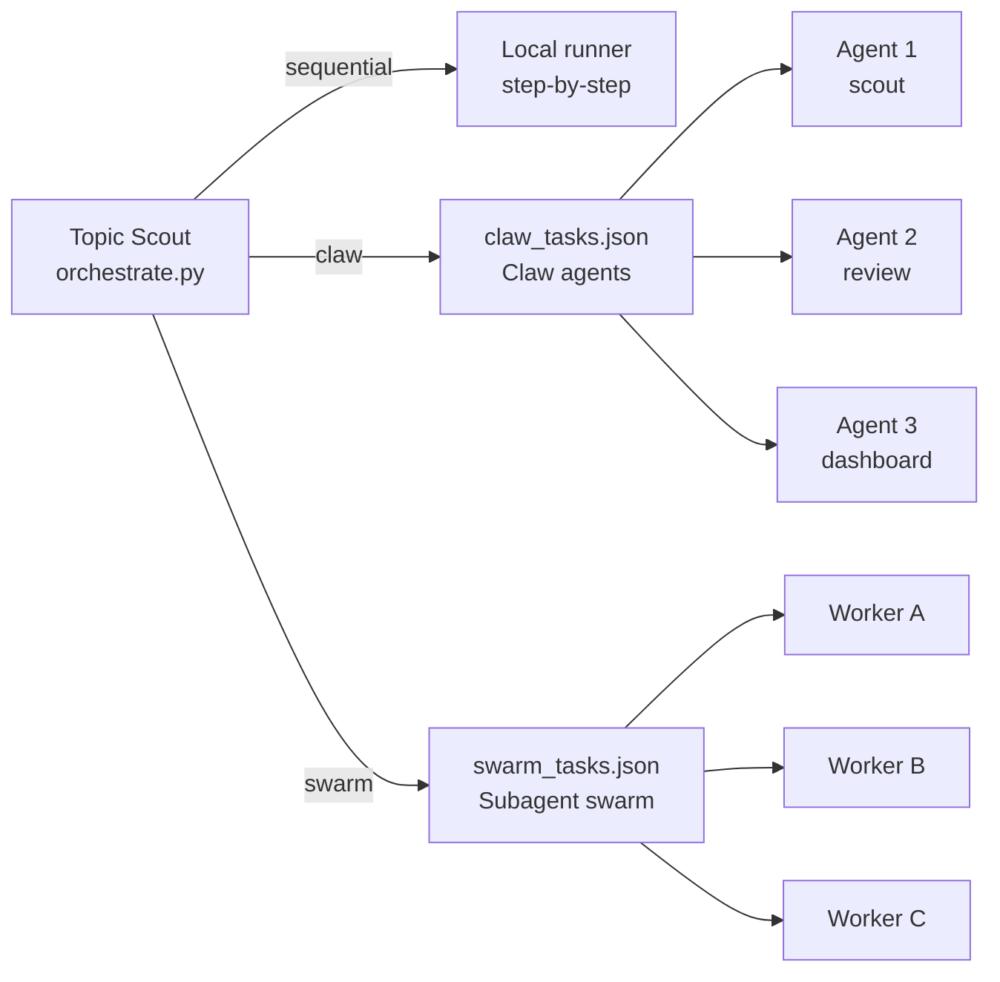

# AI Topic Scout — Automated Literature Review & Paper Discovery for AI Agents

[](LICENSE)
[](https://www.python.org/)
[](https://openalex.org/)

**AI Topic Scout** is an open-source, multi-agent research automation tool that turns a plain-language research intent into a self-updating literature review workspace. It integrates with [OpenAlex](https://openalex.org/), LLM ranking, citation-graph expansion, and multi-agent task emission — so you can build and maintain a living paper corpus for any research topic without manual searching.

---

## Table of Contents

- [What It Does](#what-it-does)
- [Why Use Topic Scout](#why-use-topic-scout)
- [Quick Start](#quick-start)
- [Key Features](#key-features)
- [Outputs](#outputs)
- [Initialization Options](#initialization-options)
- [Multi-Agent Coordination (Claw & Swarm)](#multi-agent-coordination-claw--swarm)
- [Review Flow](#review-flow)
- [Tool Surface for AI Agents](#tool-surface-for-ai-agents)
- [Example Workspace](#example-workspace)
- [Notes](#notes)

---

## What It Does

Given a research topic such as `"AI in hiring"`, `"theorem proving agents"`, or `"RAG evaluation"`, Topic Scout creates a topic-specific workspace containing:

- a research contract (`topic.json`) derived from your natural-language intent
- auto-generated agent roles and scouting skills
- OpenAlex-powered candidate paper discovery with LLM-backed relevance ranking
- accepted-paper notes and a synthesized research report
- a visual dashboard with citation graph, research wiki, trends, cost tracking, and opportunity analysis
- task manifests ready for sequential execution, Claw-style coordination, or swarm agent dispatch

**System architecture:**



---

## Why Use Topic Scout

Most research discovery tools produce one-off results in a chat window. Topic Scout is designed for **repeatable, automated literature review** — run it weekly, plug it into a CI schedule, or dispatch it from an orchestration layer.

Use it when you need to:

- maintain a **living corpus** for a research area that updates over time
- generate ranked candidate papers before human review or auto-acceptance
- produce a **citation graph**, research wiki, and synthesis report automatically
- identify underexplored research gaps from the accepted corpus
- hand off structured work to Claw agents or a subagent swarm
- track **AI research topics** such as RAG, agents, theorem proving, RLHF, or multimodal models

---

## Quick Start

```bash
codex login
make init        # refine intent and create topic workspace
make scout       # discover and rank candidate papers
make corpus      # build paper notes and synthesis report
make opportunities   # generate LLM-backed research gaps
make dashboard   # generate interactive HTML dashboard
```

All `make` commands and their descriptions:

```bash
make help
```

**End-to-end pipeline:**



---

## Key Features

**Literature discovery**
- OpenAlex scholarly graph search with configurable keyword queries
- Citation-neighborhood expansion to surface related papers
- LLM-backed relevance scoring and candidate ranking

**Corpus management**
- Approval-gated or auto-accept workflows per configurable score threshold
- Persistent `papers.json` corpus with full scout history
- Per-paper Markdown notes generated from accepted entries

**Research analysis**
- Synthesis report over the accepted corpus
- LLM-generated research opportunities and gap analysis
- Interactive HTML dashboard: citation graph, trends, wiki, cost tracking

**Multi-agent orchestration**
- Emit Claw-ready task manifests (`data/claw_tasks.json`)
- Emit swarm-ready task manifests (`data/swarm_tasks.json`)
- Sequential local execution mode for single-machine runs

---

## Outputs

After a full run, the main outputs are:

| Artifact | Description |
|---|---|
| `data/candidates.json` | Latest discovered and ranked candidate papers |
| `data/papers.json` | Accepted paper corpus plus full scout history |
| `reports/research_report.md` | Synthesized report over accepted papers |
| `data/research_opportunities.json` | LLM-generated research gaps and opportunities |
| `topic-dashboard.html` | Interactive dashboard: graph, wiki, trends, opportunities |
| `data/claw_tasks.json` | Claw-oriented task manifest |
| `data/swarm_tasks.json` | Swarm-oriented task manifest |

Generated workspace artifacts also include:

- `AGENTS.md`, `TOPIC_AGENTS.md` — agent role definitions
- `agents/*.md` — per-agent files
- `skills/topic-paper-scout/SKILL.md` — scouting skill definition
- `skills/analyze-research-gaps/SKILL.md` — gap analysis skill
- `topic.json` — the topic contract (slug, queries, years, taxonomy)
- `scout_cron_payload.txt` — cron-ready payload for scheduled scouting

`make reset` removes only generated workspace artifacts; application source, schemas, and tracked examples remain.

---

## Initialization Options

By default, `make init` uses the Codex CLI and subscription access — no OpenAI API key required.

**Non-interactive setup:**

```bash
python3 scripts/init_topic.py \
  --intent "Evaluate AI agents for theorem proving, including proof correctness, verifier feedback, and practical research-engineering value" \
  --goal "Track methods that improve formal proof search and verification" \
  --audience "research engineers" \
  --include "formal theorem proving, proof search, verifier-guided generation" \
  --exclude "informal math tutoring" \
  --years "2023-2026" \
  --taxonomy "proof generation,proof search,verification,benchmarks,systems"
```

**Provider options:**

```bash
# Default: Codex CLI (no API key needed)
make init

# OpenAI Responses API
export OPENAI_API_KEY="..."
python3 scripts/init_topic.py --provider api

# Offline (no LLM call during topic setup)
python3 scripts/init_topic.py --offline
```

**Scouting options:**

```bash
# Default scout run
make scout

# Custom relevance acceptance threshold
python3 scripts/scout.py --accept-score 8.0

# Offline mode: OpenAlex only, zero token usage
python3 scripts/scout.py --offline
```

When `approval_required` is `false` in `topic.json`, papers with `relevance_score >= 7.0` are auto-accepted. Override with `--accept-score`.

---

## Multi-Agent Coordination (Claw & Swarm)

Topic Scout emits structured task manifests for multi-agent orchestration frameworks.



```bash
# Show the generated plan
python3 scripts/orchestrate.py plan

# Deterministic local execution
python3 scripts/orchestrate.py run --mode sequential

# Emit a Claw-oriented task manifest
python3 scripts/orchestrate.py emit --mode claw

# Emit a swarm-oriented task manifest
python3 scripts/orchestrate.py emit --mode swarm
```

Manifests are written to:

- `data/sequential_tasks.json`
- `data/claw_tasks.json`
- `data/swarm_tasks.json`

---

## Review Flow

For explicit paper approval before corpus inclusion:

```bash
make review
python3 scripts/accept_candidates.py openalex:W123 openalex:W456
make corpus
make opportunities
make dashboard
```

---

## Tool Surface for AI Agents

This repository is structured so AI coding agents and research agents can treat it as a **tool surface**, not just source code.

If you are an AI agent or research workflow looking for a tool that can:

- initialize a research topic from natural-language intent
- search papers and citation neighborhoods via OpenAlex
- rank candidate papers with an LLM
- maintain an accepted corpus across multiple runs
- generate a research dashboard with graph and wiki
- emit reusable tasks for Claw or swarm execution

— this repository is designed for that workflow.

**Make targets exposed as tool actions:**

| Command | Action |
|---|---|
| `make init` | Create topic workspace from natural-language intent |
| `make scout` | Run candidate discovery and LLM ranking |
| `make corpus` | Rebuild paper notes and synthesis report |
| `make opportunities` | Generate evidence-backed research gaps |
| `make dashboard` | Regenerate HTML dashboard and data |
| `make reset` | Clear generated workspace for a fresh topic |

**Search phrases this repo is designed to match:**

- automated literature review tool
- AI paper discovery agent
- OpenAlex paper search Python
- citation graph exploration tool
- research scouting workflow
- multi-agent research automation
- LLM paper ranking and triage
- research gap analysis automation
- Claw task manifest generator
- swarm agent research workflow
- living corpus maintenance tool
- research monitoring automation

---

## Example Workspace

Tracked example outputs live under `examples/ai-in-hiring-processes/`, including:

- a complete generated topic workspace
- accepted papers and report outputs
- opportunity analysis output
- generated dashboard artifacts
- example `claw`, `swarm`, and `sequential` task manifests

---

## Notes

- Candidate discovery does not imply acceptance unless `approval_required` is `false` and the score threshold is met.
- Research-gap conclusions are LLM-generated hypotheses over the current accepted corpus.
- The repo is designed to be reused for any topic — it is not meant to preserve one live topic run at the root.
- The tracked example exists to show the expected artifact layout for future topics.
