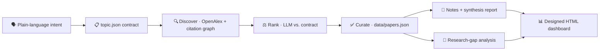

# AI Topic Scout

[](https://opensource.org/licenses/MIT)
[](https://www.python.org/)
[](https://openalex.org/)
[](AGENTS.md)

**Turn a plain-language research intent into a self-updating, beautifully formatted literature workspace — for _any_ topic.**

Describe what you want to track ("AI in hiring", "AI for theorem proving", "agent governance"). Topic Scout refines that intent into a contract, discovers and ranks papers from [OpenAlex](https://openalex.org), curates a living corpus, and publishes a designed HTML dashboard, Markdown notes, and a research-gap analysis — in a **consistent house style you never have to design or pay tokens to produce.**

> Topic Scout is the reusable, open-source engine generalized from [**EvaPaper**](https://github.com/ginaecho/EvaPaper), a living research archive on AI agent governance. EvaPaper is one topic; Topic Scout is the machine that produces an EvaPaper for whatever you care about.

---

## 🤔 Why not just use Microsoft Scout (or another scouting tool)?

Fair question — but it's partly a name collision. [**Microsoft Scout**](https://www.microsoft.com/en-us/microsoft-365/blog/2026/06/02/introducing-microsoft-scout-your-always-on-personal-agent/) (launched June 2026, built on OpenClaw — the same framework EvaPaper runs on) is an *always-on personal **work** agent* for Microsoft 365: it schedules meetings, preps materials, tracks deliverables, and flags stalled decisions across Teams, Outlook, and SharePoint. It is **not** a research-paper tool — it has no fixed research output format, no persistent topic corpus, and no per-topic analytics. Ask it to "scout papers" and it delegates to a general-purpose research sub-agent that hands back ad-hoc output.

That's the gap Topic Scout fills. It's built for one job Microsoft Scout (and general chat assistants) don't do: **producing a consistent, ownable research product over time.** The difference matters once you scout the same topic more than once.

**1. You get a house style for free — no tokens spent on formatting.**
Ask a general assistant to "scout papers and make a report," and *you* pay (in tokens, prompt engineering, and inconsistency) to specify the HTML layout, the Markdown structure, the summary format — every single run. Topic Scout ships a designed template. Every dashboard, every paper note, every synthesis report comes out in the same editorial style (warm broadsheet palette, serif display headings, an interactive wiki, a citation graph, a ranked opportunities column). You spend your tokens on **research judgment, not CSS.**

**2. Consistent analytics of the topics you actually care about.**
Because the output format is fixed, the *analytics are comparable across runs and across topics*: corpus shape by taxonomy, discovery trend over time, scout token/cost accounting, citation-neighborhood graph, evidence-backed research gaps. A chat tool gives you a different-shaped answer every time; Topic Scout gives you the **same instrument pointed at different topics.**

**3. The corpus is a durable artifact you own — not a chat transcript.**
Everything lives as plain files in your git repo: `topic.json` (the contract), `data/papers.json` (the corpus of record), Markdown notes, a self-contained HTML file. It's versioned, diffable, forkable, and self-hostable. No vendor lock-in, no re-running a prompt to recover last week's output.

**4. It runs under the agent you already use.**
Not a closed hosted product — the same `make` command surface drives **Claude Code, Codex CLI, GitHub Copilot, Copilot CLI, Microsoft-scouting-style agents, or Claw/swarm workers.** Bring your own runtime.

**5. It's opinionated about research hygiene.**
Discovery is not acceptance. Every paper keeps a stable identifier and source URL. Every gap states its evidence, inference, and uncertainty. Nothing gets fabricated. (See the hard rules in [AGENTS.md](AGENTS.md).)

|  | **AI Topic Scout** | Microsoft Scout / general work agents |
|---|---|---|
| Purpose | **Research-corpus engine** | General work autopilot (M365) |
| Output format | **Fixed house style**, zero setup | Ad-hoc, re-specified every run |
| Cross-run analytics | **Comparable** (same instrument) | None / varies per prompt |
| Persistent corpus | **Files in your git repo** | No research corpus |
| Runtime | **Any agent** (Claude/Codex/Copilot/…) | Vendor-hosted |
| Cost of formatting | **Free** (template) | Paid in tokens, every time |
| Self-host / fork | ✅ MIT | ❌ cloud-only |

**Bottom line:** use Microsoft Scout (or a chat assistant) to run your *workday*; use Topic Scout when you want a **consistent, analyzable, ownable research workspace that maintains itself** — and looks the same, good, every time.

---

## ✨ What it does

1. **Intent → contract.** Refine natural language into `topic.json` (include/exclude rules, taxonomy, dashboard sections, search queries).
2. **Discover.** Query [OpenAlex](https://openalex.org) and expand citation neighborhoods.
3. **Rank.** Score candidates with an LLM against the topic contract.
4. **Curate.** Approve into `data/papers.json`; auto-generate paper notes + a synthesis report.
5. **Analyze.** Produce an evidence-backed research-gap analysis.
6. **Publish.** One self-contained HTML dashboard — metrics, corpus shape, discovery trend, interactive wiki, citation graph, ranked opportunities.



---

## ⚖️ How relevance is judged

"Rank" is not a single opaque number from a model. The scout keeps **two independent signals** and combines them with transparent math you can tune:

1. **Cheap keyword heuristic** (offline, from OpenAlex text) — a fast include/exclude filter.
2. **LLM judge** — scores each candidate *independently* on a small rubric, and is **deliberately blinded to the heuristic score** so the two signals stay independent:
   - `topical_fit` — matches the include scope / research question
   - `evidence_match` — is it the *kind* of evidence the contract wants (`evidence_types`)?
   - `rigor` — venue / methodology / citation credibility
   - `exclusion_hit` — a hard veto when excluded scope applies

Those rubric dimensions are combined **deterministically in code** (not by the model) into a 0–10 score, weighted by your `topic.json`, with a gentle recency decay. The model judges criteria; the math does the ranking — so every score is reproducible and auditable.

**The verdict is a two-threshold band, not one cutoff:**

| Condition | Verdict |
|---|---|
| `exclusion_hit` | **reject** (veto) |
| score ≥ `accept_hi` **and** heuristic/LLM agree | **accept** (auto-curated when approval isn't required) |
| score ≤ `accept_lo` | **reject** |
| otherwise (mid-score, *or* the two signals disagree) | **uncertain** → stays in the review queue for a human |

That uncertainty band is the key: the papers most likely to be misjudged — borderline scores, or where the keyword filter and the LLM disagree — are surfaced for review instead of being silently accepted or dropped.

Tune any of it in `topic.json` (all optional, sensible defaults):

```json
"judging": {
  "weights": { "topical_fit": 0.5, "evidence_match": 0.3, "rigor": 0.2 },
  "recency": { "decay_per_year": 0.03, "floor": 0.75, "unknown_year": 0.9 },
  "accept_hi": 7.0, "accept_lo": 4.0, "min_confidence": 0.35
}
```

Weights are normalized automatically; `accept_hi`/`accept_lo` set the band; `min_confidence` is how much the two signals must agree to auto-accept. Every candidate in `data/candidates.json` carries its `rubric`, `relevance_score`, `relevance_confidence`, and `relevance_verdict` for inspection.

---

## 🎨 The house style (what ships for free)

The generated `topic-dashboard.html` is a single, dependency-free file styled as a **research broadsheet**:

- **Metrics strip** — corpus size, categories, scout runs, tokens, spend.
- **Corpus shape** — papers per taxonomy category, as a bar chart.
- **Discovery trend** — papers accepted per scout run over time.
- **Interactive wiki** — one navigable page per paper, cross-linked by shared terms.
- **Citation graph** — a canvas force-graph of the corpus, colored by category.
- **Opportunities column** — ranked, evidence-backed research gaps.

Alongside it: `reports/research_report.md` (synthesis) and `reports/papers/*.md` (one consistent note per paper). You do not design any of this. It is the same, every topic, every run.

### Theming — make it yours without touching code

The dashboard reads an optional `theme` block from `topic.json`, so a topic can carry its own palette and typography. Every key is optional and falls back to the default broadsheet look, so you can override just an accent color or go fully dark:

```json
"theme": {
  "palette": {
    "ink": "#e8ecf8", "paper": "#0e1430", "panel": "#161d3d",
    "line": "#2a355e", "muted": "#93a0c8",
    "accent": "#ff2e88", "accent2": "#22d3ee"
  },
  "fonts": {
    "display": "\"Playfair Display\", Georgia, serif",
    "body": "\"Inter\", system-ui, sans-serif"
  },
  "category_colors": ["#ff2e88", "#22d3ee", "#f5c542", "#a78bfa"]
}
```

*(That example is a full dark theme; the snippet above renders as shown below.)*

- **`palette`** — `ink` (**text color** + top rule), `paper` (page background), `panel` (cards / metric cells), `line` (borders, bar tracks, gridlines), `muted` (secondary text), `accent` / `accent2` (ranking highlights). For a dark theme, set `paper`/`panel`/`line` dark **and** `ink` light (it's the text). The citation-graph module stays a dark inset by design in every theme.
- **`fonts`** — `display` (headings) and `body` (everything else). Any CSS `font-family` stack; use web-safe fonts to keep the file self-contained.
- **`category_colors`** — the series palette used for taxonomy bars, the trend chart, and the citation graph.

Every key is optional and falls back to the default; the default (broadsheet) look is unchanged if you omit the `theme` block entirely. Then just `make dashboard` — fonts and palette are pure CSS variables, so nothing else in your workflow changes.

---

## 🚀 Quick start

```bash
git clone https://github.com/ginaecho/topic-scout.git
cd topic-scout

make init          # interview → topic.json + role briefs + skills
make scout         # OpenAlex + LLM ranking → data/candidates.json
make review        # inspect the review queue
python3 scripts/accept_candidates.py openalex:W123 openalex:W456
make corpus        # paper notes + reports/research_report.md
make opportunities # research-gap analysis
make dashboard     # topic-dashboard.html
```

Open `topic-dashboard.html` in a browser when done.

### Requirements

- Python 3.9+
- One of: [Codex CLI](https://github.com/openai/codex) (recommended, no key needed), an `OPENAI_API_KEY`, or `--offline` mode
- Optional: `git`, and a browser for the dashboard

### Provider options

```bash
make init                                                            # Codex CLI, interactive
python3 scripts/init_topic.py --intent "your topic" --provider api   # OpenAI API
python3 scripts/init_topic.py --offline                             # deterministic, no LLM
python3 scripts/scout.py --accept-score 8.0                         # auto-accept threshold
python3 scripts/scout.py --offline                                 # OpenAlex-only heuristic ranking
QUERY="benchmark X" make scout                                     # targeted supplemental query
make reset                                                         # wipe generated workspace
```

---

## 🤖 Starting an agent

Every runtime drives the same command surface — pick yours:

| Agent | Kickoff |
|---|---|
| **Claude Code** | `cd` into the repo. Claude reads `AGENTS.md` automatically. Say: *"Scout papers on &lt;topic&gt;."* |
| **Codex CLI** | `codex` in the repo root. Ask it to run `make init`, then follow `AGENTS.md`. |
| **GitHub Copilot (GHCP)** | Open the repo, run `make init`, then `python3 scripts/orchestrate.py emit --mode copilot`. Copilot follows `data/copilot_tasks.json`. |
| **Copilot CLI** | `gh copilot` in the repo. After `make init`, emit `--mode copilot-cli` and execute tasks in order. |
| **Microsoft scouting-style** | Emit `--mode microsoft-scouting`; consume `data/microsoft-scouting_tasks.json`. |
| **Claw / Swarm** | Emit `--mode claw` or `--mode swarm`; the coordinator dispatches roles under `agents/`. |

Full per-agent instructions: **[AGENTS.md](AGENTS.md)**. Active topic contract (generated by `make init`): **`TOPIC_AGENTS.md`**.

---

## 🔁 Keeping a topic fresh

The scout is topic-scoped. To keep an existing corpus current, just re-run `make scout` — it deduplicates against `data/papers.json` and appends only new candidates. To switch topics:

```bash
make reset          # clear the generated workspace
make init           # define a new topic
make scout          # discover
```

---

## 📦 Outputs

| Artifact | Purpose |
|---|---|
| `topic.json` | Topic contract (source of truth) |
| `TOPIC_AGENTS.md` | Generated topic-specific agent brief |
| `agents/*.md` | Per-role briefs (coordinator, scout, reviewer, …) |
| `data/candidates.json` | Ranked review queue |
| `data/papers.json` | Accepted corpus + scout history |
| `reports/research_report.md` | Synthesis report |
| `reports/papers/*.md` | One consistent note per paper |
| `data/research_opportunities.json` | Evidence-backed research gaps |
| `topic-dashboard.html` | Self-contained interactive dashboard |
| `data/{claw,swarm,copilot,copilot-cli,microsoft-scouting}_tasks.json` | Runtime manifests |

Worked example: [`examples/ai-in-hiring-processes/`](examples/ai-in-hiring-processes/) — a full topic workspace, dashboard included.

---

## 🗺️ Roadmap

The template is the product, so the roadmap is mostly **more of it**:

- **Theming knobs** in `topic.json` (palette, typography, category colors) so a topic can carry its own identity without touching code — ✅ **shipped** (see [Theming](#theming--make-it-yours-without-touching-code)).
- **A template gallery** — pick a *layout* at publish time (not just colors): the current broadsheet, a minimal-report theme, a slide-deck export (à la EvaPaper's PPTX), a print/PDF layout.
- **Scheduled scouting** — a cron cadence that keeps a corpus fresh and commits the diff, so the dashboard is always current.
- **More discovery signals** beyond OpenAlex (e.g. optional Semantic Scholar recommendations) behind the same contract.

Ideas and template contributions welcome — open an issue or PR.

---

## 🧪 Testing

```bash
make test
```

---

## 📄 License

MIT — see [LICENSE](LICENSE).

---

<sub>Keywords: research paper scout · literature review automation · OpenAlex · living literature review · AI research agent · topic monitoring · citation graph · research gap analysis · Claude Code · Codex CLI · GitHub Copilot · agent-agnostic · self-hosted research dashboard · alternative to Microsoft Scout.</sub>
